<!--
author:   Prof. Dr. Christian Urff
email:    christian.urff@ph-weingarten.de
version:  1.0.0
language: de
narrator: Deutsch Female

comment:  Interaktives LiaScript-Skript zur Vorlesung
          "Denken in Sachzusammenhängen — Die Mathematik der Verschlüsselung"
          (PH Weingarten).

logo:     slides/folie-01.png

mode:     Textbook

attribute: Pädagogische Hochschule Weingarten

@video
<video controls preload="metadata" width="100%" style="max-width:720px;">
  <source src="@0" type="video/mp4">
</video>
@end
-->

# Die Mathematik der Verschlüsselung

**Denken in Sachzusammenhängen**

> Prof. Dr. Christian Urff · PH Weingarten

Willkommen zum interaktiven Skript zur Vorlesung **„Die Mathematik der Verschlüsselung"**. Dieses Skript begleitet das aufgezeichnete Vorlesungsvideo — du bekommst zu jedem Thema einen **kurzen Video-Ausschnitt**, eine **kompakte Zusammenfassung**, **vertiefende Informationen** sowie **Verständnisfragen** zum Selbstcheck.

---

**So nutzt du dieses Skript:**

* Arbeite die Kapitel der Reihe nach durch — sie bauen aufeinander auf.
* Schaue dir die Video-Ausschnitte an (du kannst sie pausieren / zurückspulen).
* Probiere die interaktiven Tools direkt im Browser aus.
* Beantworte die **Verständnisfragen** am Ende jedes Kapitels — sie geben dir sofort Feedback.
* Im letzten Kapitel findest du das **Arbeitsblatt** und Vorschläge für die **Gruppenaufträge**.

**Was lernst du heute?**

* Grundprinzipien der Verschlüsselung (Klartext, Schlüssel, Chiffretext)
* Historische und symmetrische Verfahren (Caesar, Substitution, Vigenère, One-Time-Pad)
* Moderne asymmetrische Verfahren (Public-Key, RSA)
* Wie sicher Verschlüsselung ist und wie man Verschlüsselungen knacken kann
* Bezüge zur Grundschule

--{{0}}--
Willkommen im interaktiven Skript zur Vorlesung „Die Mathematik der Verschlüsselung". Arbeite die Kapitel der Reihe nach durch — jedes enthält einen Video-Ausschnitt, vertiefende Informationen und Verständnisfragen.

---

# 1. Einstieg: Wer hat heute schon verschlüsselt?

!?[Einstieg: Verschlüsselung im Alltag](clips/01-intro-alltag.mp4)

## Worum es geht

Verschlüsselung begegnet uns ständig — meist, ohne dass wir es bemerken. Schon das Aufrufen dieser Seite ist nur möglich, weil im Hintergrund Verschlüsselungsverfahren laufen.

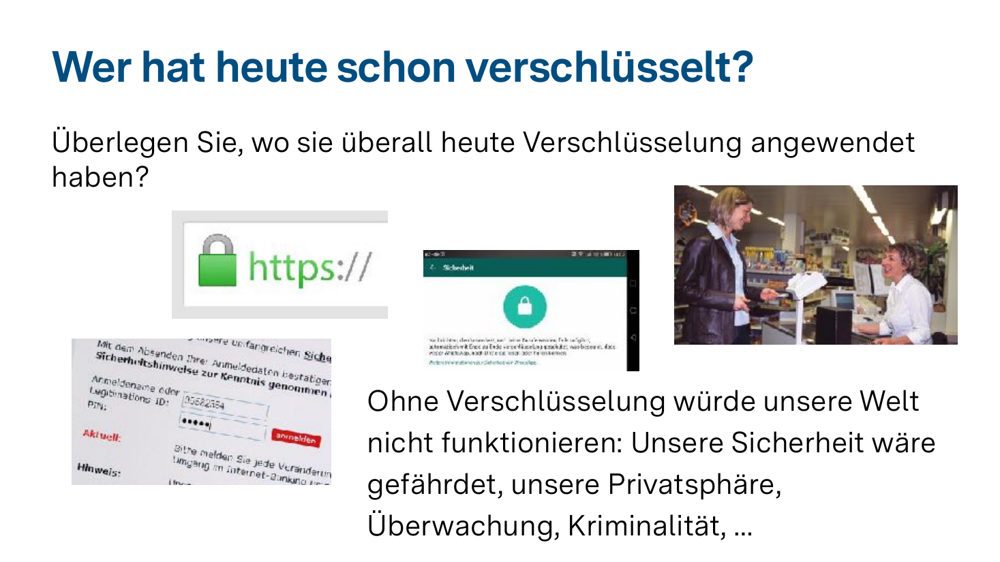

**Wo verschlüsseln wir täglich (oft unbewusst)?**

* **Web-Browsing:** Jede Seite mit `https://` ist verschlüsselt. Das `s` steht für *Security*.
* **Messenger:** WhatsApp, Signal, iMessage, Threema — alle nutzen Ende-zu-Ende-Verschlüsselung.
* **Bezahlen:** EC-Karte, Apple Pay, Google Pay, Online-Banking — alles verschlüsselt.
* **Login / Authentifizierung:** Jedes Mal, wenn du dich irgendwo anmeldest.
* **WLAN:** Dein Heimnetz ist (hoffentlich!) WPA2/WPA3-verschlüsselt, also mit Passwort.

## Warum ist das so wichtig?

Ohne Verschlüsselung wäre unsere digitale Welt nicht denkbar:

| Wäre gefährdet | Konkretes Risiko |
|---|---|
| **Privatsphäre** | Jede Nachricht wäre öffentlich lesbar |
| **Datenschutz** | Persönliche Daten frei zugänglich |
| **Sicherheit** | Kein sicheres Online-Banking, kein Online-Shopping |
| **Demokratie** | Massenhafte Überwachung im großen Stil möglich |
| **Kriminalitätsschutz** | Identitätsdiebstahl, Betrug einfach möglich |

> **Hinweis:** E-Mail ist in der Regel **NICHT** Ende-zu-Ende verschlüsselt. Für sensible Daten ist es paradoxerweise oft sicherer, sie per WhatsApp zu schicken als per E-Mail.

## Verständnisfrage 1.1

Welche der folgenden Alltagsanwendungen verwenden in der Regel **Verschlüsselung**?

[[X]] WhatsApp-Nachrichten
[[X]] HTTPS-Webseiten
[[X]] Apple Pay / Google Pay
[[ ]] Klassische E-Mail (ohne Zusatztools)
[[X]] Online-Banking
[[ ]] Offene WLAN-Hotspots ohne Passwort
[[?]] Klick auf das Fragezeichen für einen Tipp — denk an die Adresszeile und an Funkverbindungen.

    ***

    **Erläuterung:** Standard-E-Mails werden auf vielen Strecken im Klartext übertragen — deshalb ist E-Mail erstaunlich unsicher. Offene WLANs ohne Passwort sind ebenfalls unverschlüsselt; alle Daten lassen sich potenziell mitlesen.

    ***

## Verständnisfrage 1.2

Woran erkennst du **im Browser**, ob eine Webseite verschlüsselt kommuniziert?

[( )] An der Werbung auf der Seite
[(X)] Am Schlosssymbol bzw. `https://` in der Adresszeile
[( )] An der Sprache der Webseite
[( )] An der Ladezeit

---

# 2. Das Problem und seine Lösung: Alice, Bob und Max

!?[Das Grundproblem: Alice, Bob und der Lauscher Max](clips/02-problem-loesung.mp4)

## Die Grundkonstellation

In der Kryptographie hat es sich eingebürgert, mit drei Beispielfiguren zu arbeiten:

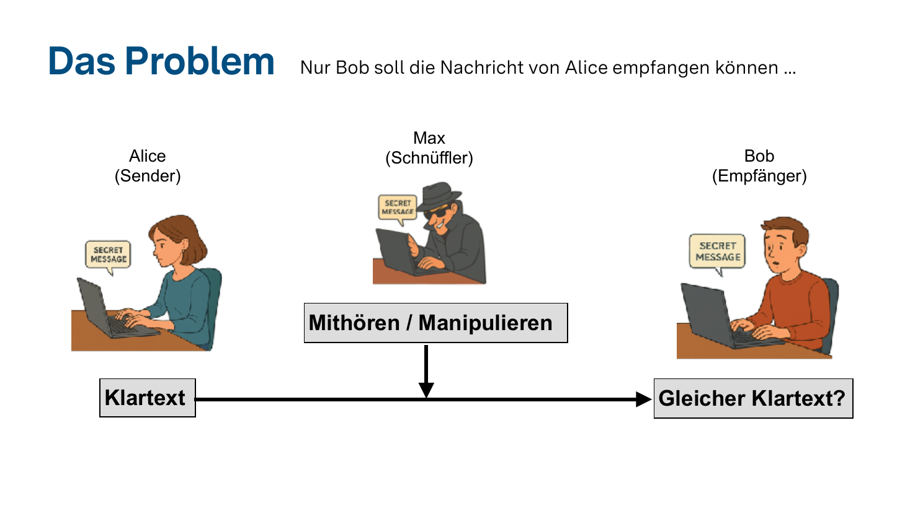

* **Alice** – die Senderin der Nachricht
* **Bob** – der Empfänger
* **Max** (in der englischen Literatur „Eve" oder „Mallory") – der/die Schnüffler:in dazwischen

**Ohne Verschlüsselung** kann Max die Nachricht auf dem Weg von Alice zu Bob:

1. **Mithören** — er liest mit, was geschrieben wird (passiver Angriff)
2. **Manipulieren** — er verändert die Nachricht heimlich (aktiver Angriff)

## Die Lösung: Verschlüsselung

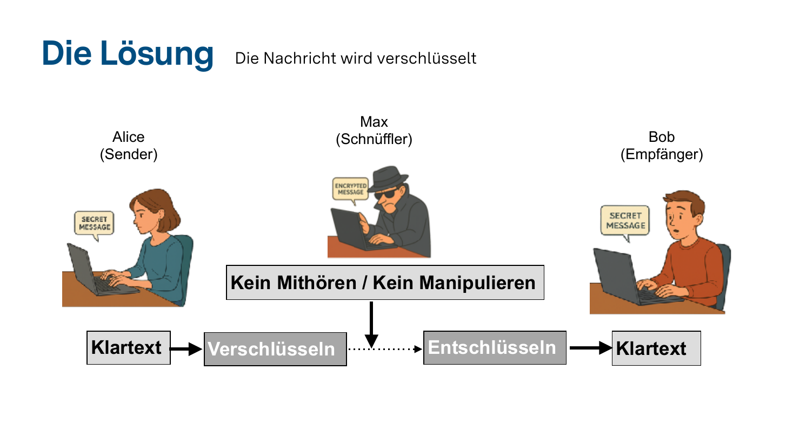

Alice **verschlüsselt** ihre Nachricht (den **Klartext**) zu einer scheinbar unleserlichen Nachricht (dem **Chiffretext**). Bob **entschlüsselt** sie mit dem passenden Schlüssel wieder. Max sieht zwar den Chiffretext, kann aber nichts damit anfangen.

```text
Klartext  ──[Verschlüsseln]──>  Chiffretext  ──[Entschlüsseln]──>  Klartext
   Alice                          (über Netz)                        Bob
                                       │
                                       ↓ kann mithören, aber nichts lesen
                                      Max
```

## Was moderne Verfahren zusätzlich leisten

Moderne Verfahren schützen nicht nur vor dem Mitlesen, sondern auch vor Manipulation:

* **Vertraulichkeit:** Nur Bob kann lesen.
* **Integrität:** Bob merkt, wenn etwas verändert wurde.
* **Authentizität:** Bob weiß sicher, dass die Nachricht wirklich von Alice kommt (**digitale Signatur**).

## Verständnisfrage 2

Welche Aussagen über das Alice–Bob–Max-Modell stimmen?

[[X]] Alice ist die Senderin, Bob ist der Empfänger.
[[X]] Max kann ohne Verschlüsselung die Nachricht mitlesen und auch manipulieren.
[[X]] Mit moderner Verschlüsselung kann Bob feststellen, ob unterwegs etwas verändert wurde.
[[ ]] Alice und Bob müssen sich nie über die verwendete Verschlüsselungsmethode einig sein.
[[ ]] Wenn Max die Nachricht abfängt, ist die Kommunikation auf jeden Fall verloren.

    ***

    **Erläuterung:** Selbst wenn Max die *verschlüsselte* Nachricht abfängt, kann er sie ohne Schlüssel nicht lesen. Alice und Bob müssen sich aber zumindest auf ein gemeinsames Verfahren (und meist auch einen Schlüssel) einigen.

    ***

---

# 3. Kryptologie, Kryptographie & Kryptoanalyse

!?[Begriffe und ein historischer Blick](clips/03-kryptologie-geschichte.mp4)

## Drei Begriffe — eine Wissenschaft

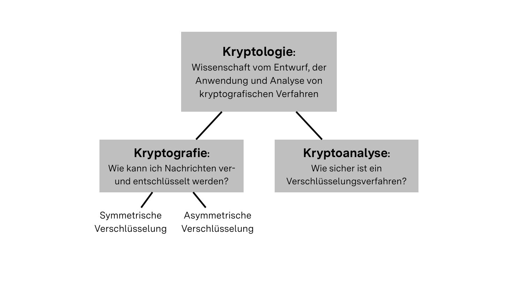

* **Kryptologie** — die übergeordnete Wissenschaft vom Entwurf, der Anwendung und Analyse kryptographischer Verfahren.
* **Kryptographie** — *Wie* kann ich Nachrichten ver- und entschlüsseln? (= das „Bauen" von Verfahren)
  * **Symmetrische Verschlüsselung** — gleicher Schlüssel auf beiden Seiten
  * **Asymmetrische Verschlüsselung** — verschiedene Schlüssel zum Ver- und Entschlüsseln
* **Kryptoanalyse** — *Wie sicher* ist ein Verfahren? Kann ich es knacken?

> **Merksatz:** Kryptographie *baut* Schlösser, Kryptoanalyse versucht sie zu *öffnen*. Beide brauchen einander, um besser zu werden.

## Ein kurzer historischer Streifzug

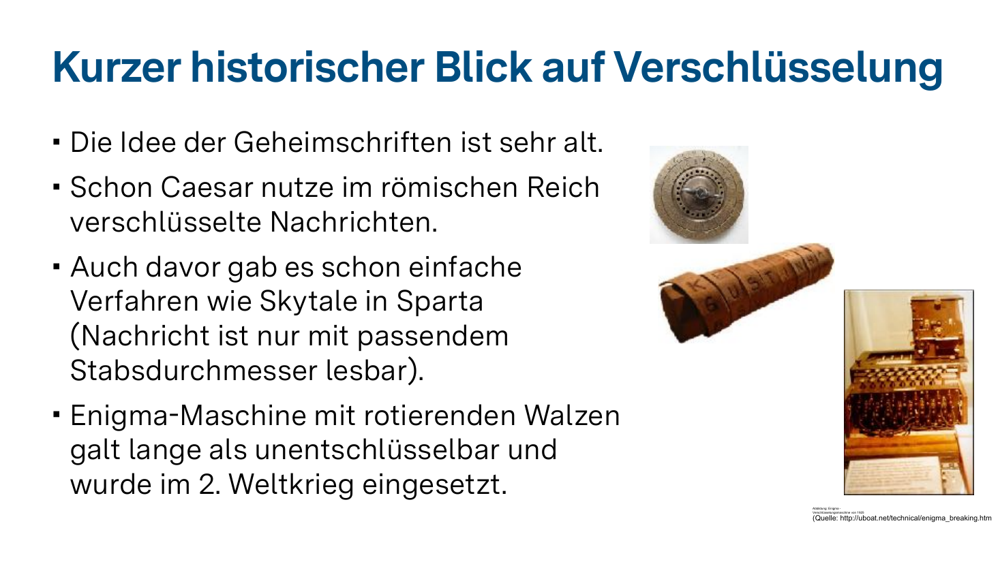

Die Idee, Botschaften geheim zu halten, ist sehr alt:

| Epoche | Verfahren | Idee |
|---|---|---|
| ~500 v. Chr. (Sparta) | **Skytale** | Lederband um Stab passender Dicke wickeln |
| ~50 v. Chr. (Rom) | **Caesar-Chiffre** | Alphabet um *n* Buchstaben verschieben |
| 16. Jh. | **Vigenère-Verfahren** | Verschiebung wechselt mit Codewort |
| 2. Weltkrieg | **Enigma-Maschine** | Rotierende Walzen, galt lange als unknackbar |
| Heute | **AES, RSA, ECC** | Mathematisch hochkomplexe Verfahren |

### Skytale (Sparta)

Ein **Pergamentband** wurde spiralförmig um einen Stab mit bestimmtem Durchmesser gewickelt. Die Nachricht wurde quer geschrieben. Ohne den passenden Stab erhielt man nur eine Aneinanderreihung scheinbar zufälliger Buchstaben.

**Der Stab war der Schlüssel.**

### Enigma (2. Weltkrieg)

Die deutsche Wehrmacht setzte die Enigma-Maschine ein. Sie galt als unentschlüsselbar — bis es britischen Mathematikern um **Alan Turing** in Bletchley Park gelang, sie zu knacken. Das verkürzte den Krieg vermutlich um Jahre und hat die Geburtsstunde der modernen Informatik mitgeprägt.

## Verständnisfrage 3

Ordne richtig zu — welcher Teilbereich der Kryptologie beschäftigt sich womit?

[(X)] Kryptographie baut Verschlüsselungsverfahren — Kryptoanalyse versucht sie zu knacken.
[( )] Kryptoanalyse baut Verschlüsselungsverfahren — Kryptographie versucht sie zu knacken.
[( )] Kryptologie und Kryptographie sind exakt dasselbe.
[( )] Kryptoanalyse beschäftigt sich nur mit historischen Verfahren.

---

# 4. Die Caesar-Verschlüsselung

!?[Wie das Caesar-Verfahren funktioniert](clips/04-caesar.mp4)

## Das Prinzip

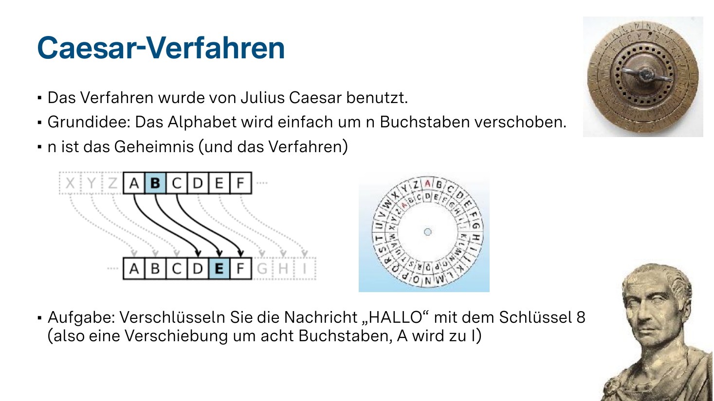

Die **Caesar-Chiffre** ist eine der ältesten bekannten Verschlüsselungen. Julius Caesar nutzte sie für militärische Botschaften.

**Idee:** Das Alphabet wird einfach um eine feste Zahl `n` Stellen verschoben.

Beispiel mit Verschiebung **n = 3**:

```text
Klartext:    A B C D E F G H I J K L M N O P Q R S T U V W X Y Z
Chiffretext: D E F G H I J K L M N O P Q R S T U V W X Y Z A B C
```

* `n` ist der **Schlüssel** — Alice und Bob müssen ihn vorab vereinbaren.
* Bei Verschiebung um 3 wird aus `HALLO` → `KDOOR`.

## Aufgabe: Verschlüssele „HALLO" mit Schlüssel **n = 8**

Verschiebe jeden Buchstaben um 8 Stellen im Alphabet nach hinten (`A → I`, `B → J`, ...).

```text
H → ?
A → ?
L → ?
L → ?
O → ?
```

[[PITTW]]
[[?]] Wenn du über `Z` hinauskommst, beginne wieder bei `A` (modulo 26).

    ***

    **Lösungsweg:** H(8)→P, A(0)→I, L(11)→T, L(11)→T, O(14)→W → **PITTW**

    ***

## Interaktiv ausprobieren

Probiere das Caesar-Verfahren direkt im eingebetteten Tool aus — verschiebe den Schlüssel, gib Texte ein und schau, was passiert:

<iframe src="https://www.lernsoftware-mathematik.de/DiS/caesar.html"
        width="100%" height="650"
        style="border: 1px solid #ccc; border-radius: 4px;"
        loading="lazy"
        title="Caesar-Verschlüsselung interaktiv">
</iframe>

🔗 Direktlink (im neuen Tab öffnen): [Caesar-Tool](https://www.lernsoftware-mathematik.de/DiS/caesar.html)

## Verständnisfrage 4

Mit dem Caesar-Verfahren wurde der Text `KDOOR` erzeugt. Wie lautet der Klartext, wenn die Verschiebung **3** war?

[[HALLO]]
<script>
let answer = "@input".toUpperCase().trim();
answer === "HALLO";
</script>

---

# 5. Caesar knacken: Probieren & Häufigkeitsanalyse

!?[Caesar-Verschlüsselung knacken](clips/05-caesar-knacken.mp4)

## Warum ist Caesar so leicht zu knacken?

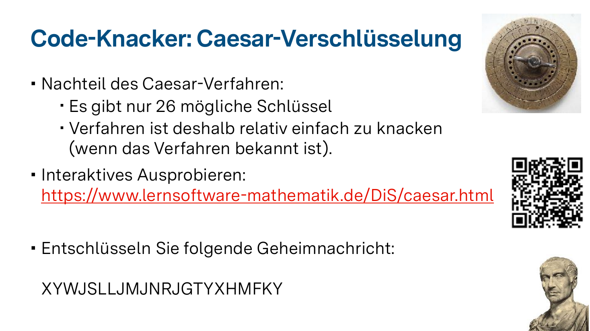

Das Caesar-Verfahren hat einen großen Nachteil:

> **Es gibt nur 26 mögliche Schlüssel** (eigentlich 25, da `n=0` keine Verschlüsselung wäre).

### Möglichkeit 1: Einfach durchprobieren (Brute Force)

Mit einem Computer dauert das Durchprobieren aller 26 Schlüssel weniger als eine Sekunde. Selbst von Hand schafft man das in ein paar Minuten.

### Möglichkeit 2: Häufigkeitsanalyse

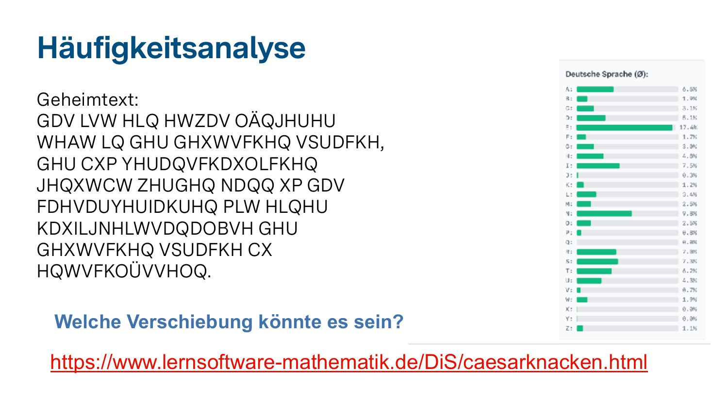

Buchstaben kommen in jeder Sprache mit charakteristischen Häufigkeiten vor. Im Deutschen:

| Buchstabe | Häufigkeit |
|---|---|
| **E** | ~17,4 % |
| **N** | ~9,8 % |
| **I** | ~7,5 % |
| **R** | ~7,0 % |
| **S** | ~7,3 % |
| **T** | ~6,2 % |
| ... | ... |
| **X** | ~0,0 % |
| **Y** | ~0,0 % |

**Trick:** Bei einer Caesar-Chiffre bleibt diese Häufigkeitsverteilung **erhalten** — sie wird nur verschoben. Findet man im Chiffretext einen sehr häufigen Buchstaben, ist das mit hoher Wahrscheinlichkeit das verschlüsselte `E`. Aus dem Abstand zwischen dem Geheimbuchstaben und `E` ergibt sich der Schlüssel `n`.

## Knack-Übung

Entschlüssele folgende Caesar-Nachricht (aus dem Arbeitsblatt):

```text
XYWJSLLJMJNRJGTYXHMFKY
```

**Knacker-Tool direkt eingebettet** (Häufigkeitstabelle automatisch berechnet):

<iframe src="https://www.lernsoftware-mathematik.de/DiS/caesarknacken.html"
        width="100%" height="650"
        style="border: 1px solid #ccc; border-radius: 4px;"
        loading="lazy"
        title="Caesar knacken — Häufigkeitsanalyse">
</iframe>

🔗 Direktlink: [Caesar knacken](https://www.lernsoftware-mathematik.de/DiS/caesarknacken.html)

**Trage deine Lösung ein:**
[[STRENGGEHEIMEBOTSCHAFT]]
<script>
"@input".toUpperCase().replace(/[\s\.\,]/g,"") === "STRENGGEHEIMEBOTSCHAFT";
</script>
[[?]] Suche im Geheimtext nach dem häufigsten Buchstaben — er entspricht in der deutschen Sprache wahrscheinlich dem `E`.

    ***

    **Lösungsweg:** Die Verschiebung war **n = 5**. Aus `X` wird `S` (5 Stellen zurück), aus `Y` wird `T`, usw. Klartext: **STRENG GEHEIME BOTSCHAFT**.

    ***

## Verständnisfrage 5

Warum gilt das Caesar-Verfahren heute als **unsicher**?

[[X]] Es gibt nur 26 mögliche Schlüssel.
[[X]] Mit Häufigkeitsanalyse lässt sich der Schlüssel auch bei kurzen Texten leicht finden.
[[X]] Computer probieren alle Schlüssel in Sekundenbruchteilen durch.
[[ ]] Es funktioniert nur auf Latein.
[[ ]] Es lässt sich gar nicht implementieren.

## Vertiefung: Was bedeutet das didaktisch?

> Für die **Grundschule** ist das Caesar-Verfahren ein wunderbares Werkzeug: Kinder können eigene Caesar-Scheiben basteln (zwei drehbare Kreise mit Alphabeten), verschlüsseln und einander Botschaften übergeben. Es schult **logisches Denken**, **Mustererkennung** und ist motivierend, weil „echte Geheimschrift" entsteht.

---

# 6. Substitutions- & Vigenère-Verfahren

!?[Knacken schwerer machen: Substitution und Vigenère](clips/06-vigenere.mp4)

## Mehr Schlüsselraum: Allgemeine Substitution

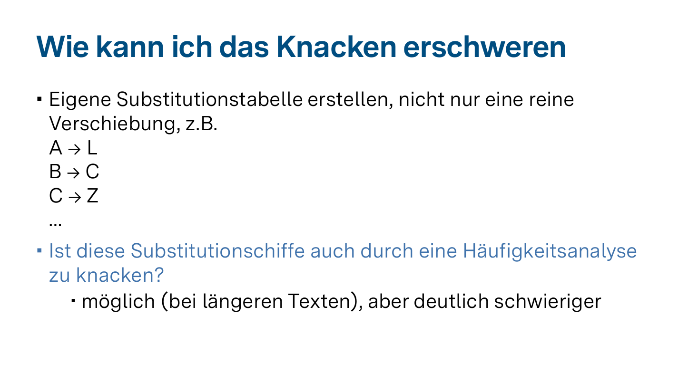

Statt nur einer **Verschiebung** kann man jedem Buchstaben einen **beliebigen** anderen zuordnen. Z. B.:

```text
A → L
B → C
C → Z
D → Q
...
```

* Zahl der möglichen Schlüssel: **26! ≈ 4 · 10²⁶** (eine 27-stellige Zahl!).
* Brute Force aussichtslos.
* **Aber:** Häufigkeitsanalyse funktioniert weiterhin — denn jedes `E` wird immer auf denselben Geheimbuchstaben abgebildet. Bei längeren Texten knackbar.

## Das Vigenère-Verfahren

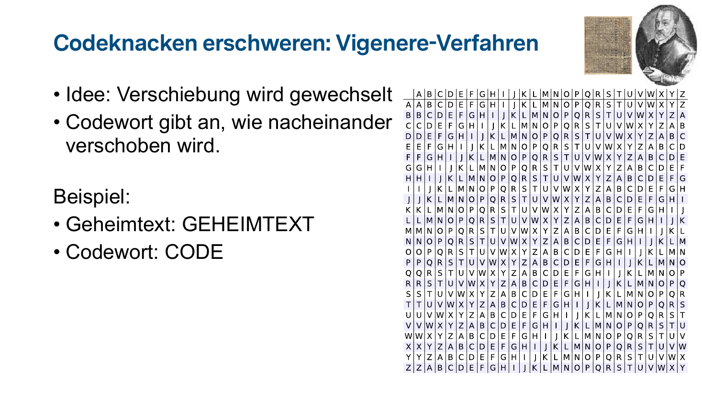

**Idee von Blaise de Vigenère (1586):** Die Verschiebung **wechselt** mit jedem Buchstaben — gesteuert durch ein **Codewort** (Passwort).

### Beispiel: Klartext = `GEHEIMTEXT`, Codewort = `CODE`

| Position | Klartext | Codewort-Buchstabe | Verschiebung | Chiffre |
|---|---|---|---|---|
| 1 | G | C | +2 | **I** |
| 2 | E | O | +14 | **S** |
| 3 | H | D | +3 | **K** |
| 4 | E | E | +4 | **I** |
| 5 | I | C *(wiederholt)* | +2 | **K** |
| 6 | M | O | +14 | **A** |
| 7 | T | D | +3 | **W** |
| 8 | E | E | +4 | **I** |
| 9 | X | C | +2 | **Z** |
| 10 | T | O | +14 | **H** |

**Chiffretext:** `ISKIKAWIZH`

**Beachte:** Das `E` im Klartext wird mal zu `S`, mal zu `I`, mal zu `I`. Die Häufigkeitsanalyse versagt — solange das Codewort unbekannt ist!

### Vigenère interaktiv

<iframe src="https://www.lernsoftware-mathematik.de/DiS/vigenere.html"
        width="100%" height="650"
        style="border: 1px solid #ccc; border-radius: 4px;"
        loading="lazy"
        title="Vigenère-Verschlüsselung interaktiv">
</iframe>

🔗 Direktlink: [Vigenère-Tool](https://www.lernsoftware-mathematik.de/DiS/vigenere.html)

## Wie wird Vigenère geknackt?

Lange galt Vigenère als unknackbar — bis im 19. Jh. **Friedrich Kasiski** und **Charles Babbage** unabhängig voneinander einen Weg fanden:

1. **Schlüssellänge bestimmen:** Wiederholungen im Chiffretext verraten oft die Codewortlänge (Kasiski-Test, Friedman-Test).
2. **Pro Position Häufigkeitsanalyse:** Hat das Codewort z. B. die Länge 8, betrachtet man alle Buchstaben an Positionen 1, 9, 17, … — sie wurden mit demselben Schlüsselbuchstaben verschoben, also wieder ein Caesar-Problem!

🔗 [Vigenère knacken (interaktiv)](https://oinf.ch/interactive/vigenere-verschluesselung-knacken/)

## Verständnisfrage 6

Warum ist Vigenère **sicherer** als eine reine Substitution, aber trotzdem nicht **unknackbar**?

[(X)] Weil derselbe Klartextbuchstabe je nach Position zu unterschiedlichen Chiffretextbuchstaben wird — aber das wiederkehrende Codewort erzeugt trotzdem Muster, die mathematisch ausgenutzt werden können.
[( )] Weil Vigenère gar keine Mathematik verwendet.
[( )] Weil das Codewort beliebig lang sein kann und niemand es errät.
[( )] Weil das Verfahren auf einem geheimen Algorithmus beruht.

---

# 7. Absolut sicher: Das One-Time-Pad

!?[Das One-Time-Pad: theoretisch unknackbar](clips/07-one-time-pad.mp4)

## Was ist das One-Time-Pad?

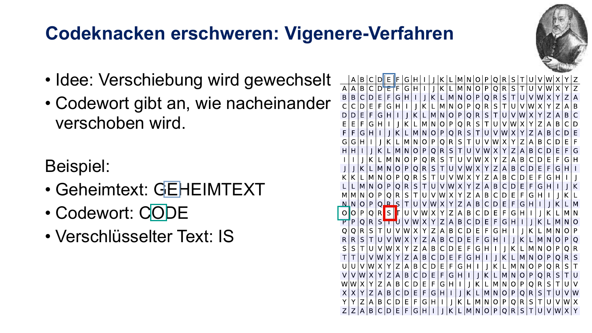

Das **One-Time-Pad (OTP)** ist die einzige Verschlüsselungsmethode, die **mathematisch beweisbar absolut sicher** ist (Shannon, 1949).

**Bedingungen:**

1. Der Schlüssel ist **wirklich zufällig** (kein Wort aus dem Wörterbuch!).
2. Der Schlüssel ist **mindestens so lang** wie die Nachricht.
3. Der Schlüssel wird **nur ein einziges Mal** verwendet (daher: *One-Time*).
4. Der Schlüssel wird **geheim** zwischen Sender und Empfänger ausgetauscht.

## So funktioniert es (binär, mit XOR)

```text
Klartext:  0000 0111 1100 0101
Pad:    ⊕  0011 1101 0001 1000
           ─────────────────────
Cipher:    0011 1010 1101 1101
```

Beim Empfänger: gleicher Schlüssel nochmal XOR-verknüpft → Klartext erscheint zurück.

> **Warum unknackbar?** Zu jedem Chiffretext gibt es *jeden* denkbaren Klartext gleicher Länge als mögliche Lösung — abhängig vom angenommenen Schlüssel. Es gibt keinen Hinweis, welcher davon stimmt.

## Warum nutzt man es dann nicht überall?

**Praktische Probleme:**

* Schlüssel muss **so lang** sein wie die gesamte Kommunikation.
* Schlüssel muss **sicher ausgetauscht** werden — wie aber, wenn man ihn nicht persönlich übergeben kann?
* Schlüssel muss **wirklich zufällig** sein — Computer-„Zufall" ist oft nur Pseudo-Zufall.
* Schlüssel **darf nie wiederverwendet** werden — sonst Angreifer kann Muster ausnutzen.

**Wo wird es trotzdem eingesetzt?**

* **„Heißer Draht"** zwischen Moskau und Washington im Kalten Krieg.
* Bei extrem hohen Sicherheitsanforderungen (Diplomatie, Geheimdienste).

## Verständnisfrage 7

Was ist der **größte Nachteil** des One-Time-Pads in der Praxis?

[( )] Es ist zu unsicher.
[(X)] Der Schlüsselaustausch — der Schlüssel muss so lang wie die Nachricht und sicher übermittelt sein.
[( )] Es funktioniert nur mit Buchstaben, nicht mit Zahlen.
[( )] Es wurde patentiert und ist deshalb teuer.

---

# 8. Das Schlüsseltausch-Problem

!?[Warum symmetrische Verfahren an Grenzen stoßen](clips/08-schluesselproblem.mp4)

## Symmetrische Verschlüsselung — alle Verfahren bisher

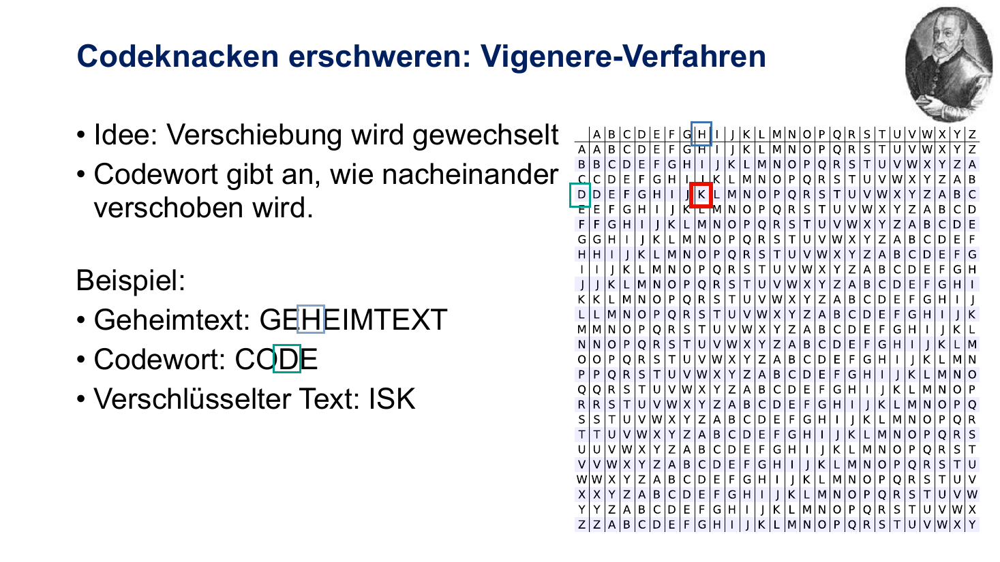

Alle bisherigen Verfahren (Caesar, Substitution, Vigenère, One-Time-Pad) sind **symmetrisch**:

> Der **gleiche** Schlüssel wird zum **Ver-** und zum **Entschlüsseln** verwendet.

```text
Alice ──[Schlüssel K, Klartext]──> Chiffre ──[Schlüssel K]──> Bob
```

## Das Kernproblem

**Wie kommt der Schlüssel sicher von Alice zu Bob?**

* Schickt Alice den Schlüssel **unverschlüsselt**, kann Max ihn abfangen.
* Schickt Alice den Schlüssel **verschlüsselt**, braucht sie wieder einen Schlüssel dafür — und so weiter (*Henne-Ei-Problem*).

### Beispiel Amazon

Stell dir vor, du möchtest sicher bei Amazon einkaufen:

* Du müsstest **persönlich** zu Amazon fahren und einen Schlüssel vereinbaren.
* Das ist offensichtlich **unmöglich** — und für Milliarden Webseiten-Aufrufe pro Tag erst recht.

> **Konsequenz:** Mit rein symmetrischer Verschlüsselung wäre das Internet, wie wir es kennen, nicht möglich.

## Verständnisfrage 8

Warum ist der **Schlüsselaustausch** bei symmetrischen Verfahren ein Problem?

[[X]] Wer den Schlüssel auf dem Übertragungsweg abfängt, kann alle Nachrichten lesen.
[[X]] Bei vielen Kommunikationspartnern werden sehr viele Schlüssel benötigt.
[[X]] Im Internet kann man den Schlüssel nicht einfach persönlich übergeben.
[[ ]] Symmetrische Verfahren sind grundsätzlich mathematisch unsicher.
[[ ]] Symmetrische Verschlüsselung funktioniert nur mit dem One-Time-Pad.

    ***

    **Erläuterung:** Symmetrische Verfahren (insbesondere **AES**) sind sehr sicher und werden auch heute massenhaft eingesetzt — *aber* erst, nachdem mit Hilfe asymmetrischer Verfahren ein gemeinsamer Sitzungsschlüssel etabliert wurde. Das löst das Problem (siehe nächstes Kapitel).

    ***

---

# 9. Asymmetrische Verfahren & RSA (Public-Key)

!?[Asymmetrische Verschlüsselung und das RSA-Verfahren](clips/09-rsa-publickey.mp4)

## Die geniale Idee: Zwei Schlüssel pro Person

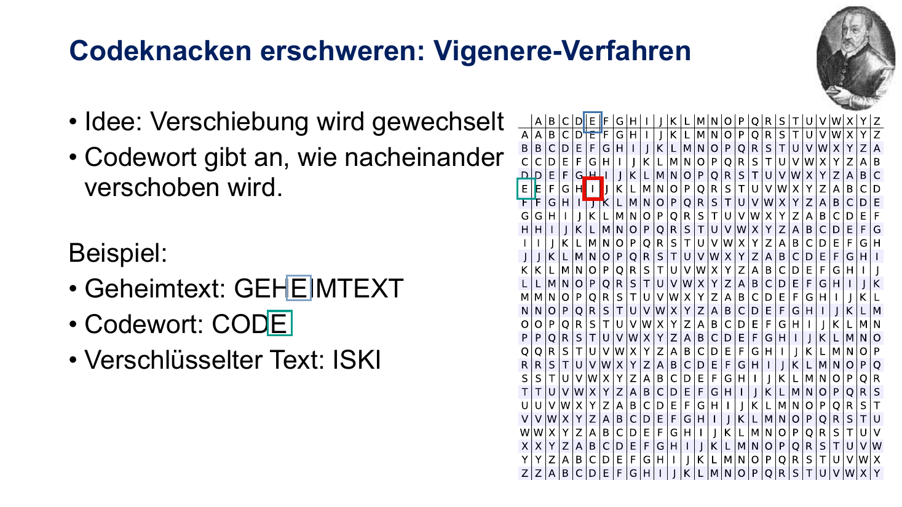

Jede Person besitzt **zwei** zusammengehörige Schlüssel:

* **🔓 Öffentlicher Schlüssel (Public Key)** — wird *veröffentlicht*. Damit verschlüsselt jeder, der Bob eine Nachricht schicken möchte.
* **🔐 Privater Schlüssel (Private Key)** — bleibt geheim bei Bob. Nur damit lässt sich die Nachricht wieder *entschlüsseln*.

**Wichtig:** Was mit dem öffentlichen Schlüssel verschlüsselt wurde, lässt sich **nur** mit dem zugehörigen privaten Schlüssel wieder entschlüsseln — *nicht* mit dem öffentlichen!

```text
Alice  ──[verschlüsselt mit Bobs Public Key]──>  Chiffre  ──>  Bob
                                                              │
                                                              ↓
                                                  [entschlüsselt mit Bobs Private Key]
```

> **Genialer Trick:** Der Schlüssel zum *Verschlüsseln* (Public Key) darf öffentlich sein. Es muss kein geheimer Schlüssel mehr ausgetauscht werden!

## Das RSA-Verfahren

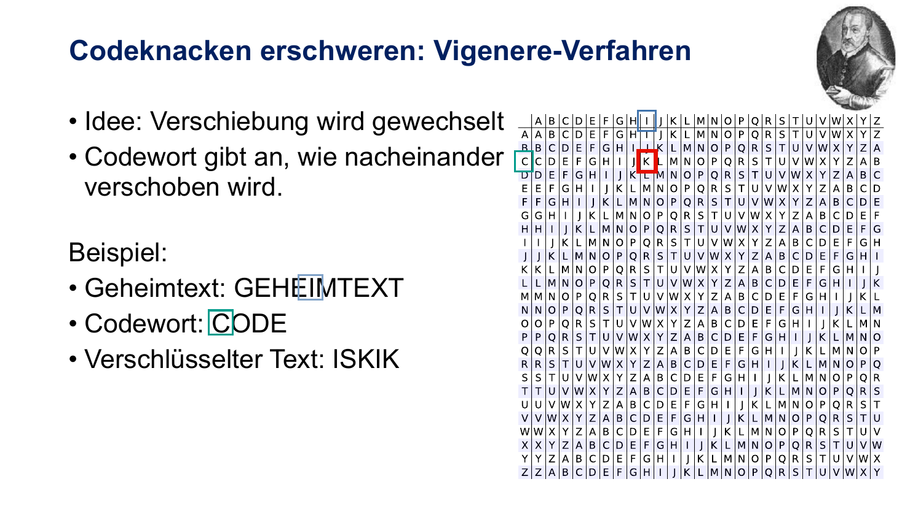

**RSA** wurde 1977 von **R**ivest, **S**hamir und **A**dleman am MIT entwickelt. Es ist bis heute Grundlage fast aller modernen Internet-Verschlüsselung.

### Die mathematische Idee: Einwegfunktionen

Eine **Einwegfunktion** ist leicht zu berechnen, aber praktisch nicht umkehrbar.

#### Anschauliches Beispiel: Telefonbuch

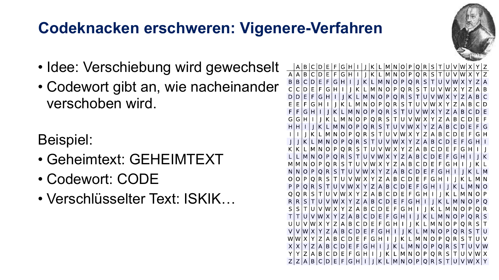

* **Vorwärts (leicht):** Namen → Telefonnummer suchen. Im alphabetisch sortierten Buch in Sekunden gefunden.
* **Rückwärts (schwer):** Telefonnummer → Name finden. Man müsste **alle Einträge** durchsehen.

### Die mathematische Einwegfunktion in RSA: Primfaktorzerlegung

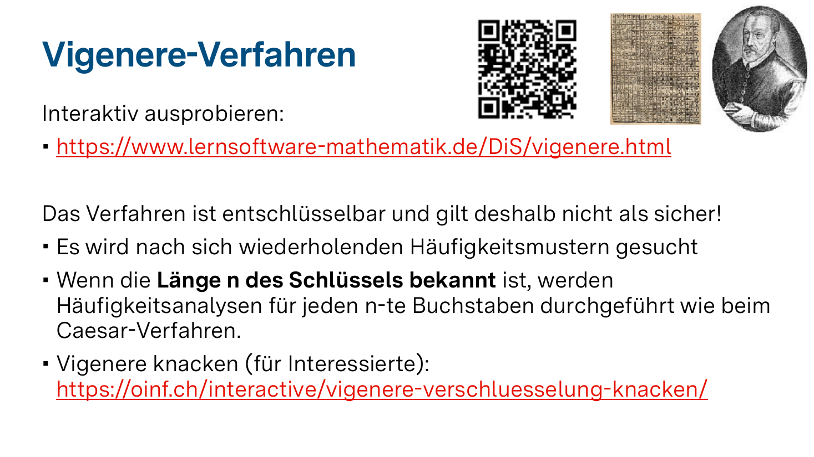

**Das Prinzip:**

> Es ist **leicht**, zwei (große) Primzahlen zu multiplizieren.
> Es ist **extrem schwer**, ein Produkt zurück in seine Primfaktoren zu zerlegen.

**Kleines Beispiel:**

* Multiplikation: `17 · 23 = ?` → kann jede:r im Kopf rechnen → **391**
* Umkehrung: Welche zwei Primzahlen ergeben **391**? → Du musst probieren: ist 391 durch 2 teilbar? 3? 5? 7? 11? 13? 17? → ja! → 391 / 17 = 23. Schon bei dreistelligen Zahlen aufwändiger.

**In der Praxis:**

* RSA verwendet Primzahlen mit **256+ Stellen**.
* Multiplikation: Sekundenbruchteile.
* Umkehrung (Faktorisierung): Selbst Supercomputer brauchen **Jahre bis Jahrhunderte**.

### RSA interaktiv ausprobieren

<iframe src="https://www.lernsoftware-mathematik.de/DiS/rsa.html"
        width="100%" height="700"
        style="border: 1px solid #ccc; border-radius: 4px;"
        loading="lazy"
        title="RSA-Verfahren interaktiv">
</iframe>

🔗 Direktlink: [RSA-Tool](https://www.lernsoftware-mathematik.de/DiS/rsa.html)

## Wo wird RSA / Asymmetrisches eingesetzt?

| Anwendung | Was passiert? |
|---|---|
| **HTTPS / TLS** | Beim Seitenaufruf wird ein temporärer Sitzungsschlüssel asymmetrisch ausgetauscht. |
| **Messenger** | Schlüsselaustausch für Ende-zu-Ende-Verschlüsselung. |
| **Digitale Signaturen** | Beweisen die Identität des Absenders (z. B. bei Software-Updates). |
| **SSH-Login** | Zugang zu Servern per Schlüsselpaar statt Passwort. |
| **Bezahlsysteme** | Sichere Transaktionen ohne vorherigen physischen Kontakt. |

## Vertiefung: Wie sicher ist RSA langfristig?

* **Schlüssellängen wachsen mit:** Früher 128 Bit, heute 2048-4096 Bit empfohlen.
* **Quantencomputer:** Ein leistungsfähiger Quantencomputer könnte mit dem **Shor-Algorithmus** RSA in Polynomialzeit brechen. **Post-Quanten-Kryptographie** ist aktives Forschungsfeld.
* **Aktueller Stand (2025):** Es gibt erste experimentelle Quantencomputer, aber noch keine, die RSA mit realistischen Schlüssellängen brechen können. Trotzdem wird bereits aktiv migriert.

## Verständnisfrage 9.1

Was ist der **entscheidende Vorteil** asymmetrischer Verfahren?

[( )] Sie sind schneller als symmetrische Verfahren.
[(X)] Es muss kein geheimer Schlüssel vorab ausgetauscht werden.
[( )] Sie benötigen kürzere Schlüssel.
[( )] Sie sind absolut sicher gegen Quantencomputer.

## Verständnisfrage 9.2

Auf welcher mathematischen Schwierigkeit beruht die Sicherheit von RSA?

[(X)] Die Primfaktorzerlegung großer Zahlen ist sehr aufwändig.
[( )] Die Addition großer Zahlen ist aufwändig.
[( )] Die Erzeugung von Buchstaben aus Zahlen ist aufwändig.
[( )] Das Sortieren von Zahlen ist aufwändig.

## Verständnisfrage 9.3

Was passiert, wenn jemand **deinen öffentlichen Schlüssel** kennt?

[( )] Er kann all deine Nachrichten lesen.
[( )] Er kann sich als du ausgeben.
[(X)] Er kann dir verschlüsselte Nachrichten schicken — sonst nichts.
[( )] Es ist eine schwere Sicherheitslücke.

---

# 10. Fazit & Bezug zur Grundschule

!?[Fazit und didaktische Bezüge zur Grundschule](clips/10-fazit-grundschule.mp4)

## Was wir gelernt haben

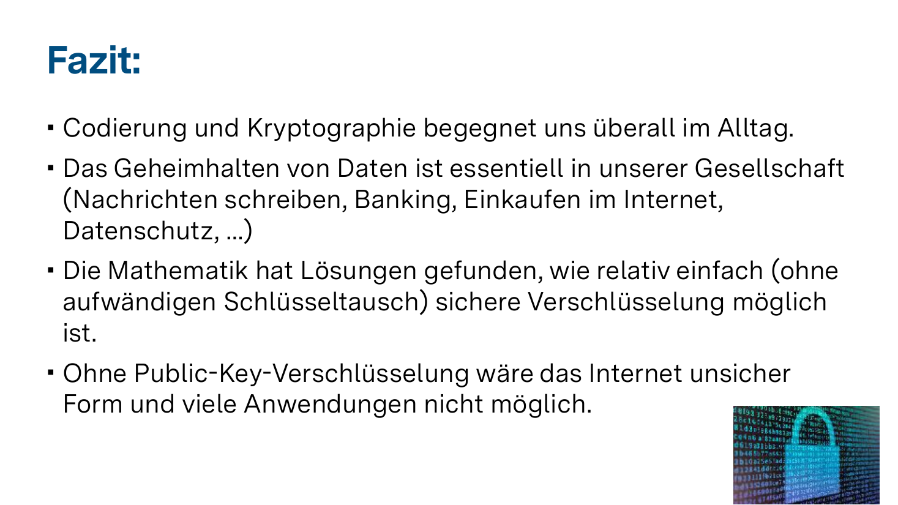

* **Kodierung und Kryptographie** begegnen uns überall im Alltag — meist unsichtbar.
* **Geheimhalten von Daten** ist essentiell für unsere Gesellschaft (Banking, Messenger, Shopping, Datenschutz).
* **Die Mathematik** hat Lösungen entwickelt — von der einfachen Caesar-Chiffre bis hin zu RSA und modernen Verfahren.
* **Ohne Public-Key-Verfahren** wäre das heutige Internet in dieser Form nicht möglich.

## Was hat das mit der Grundschule zu tun?

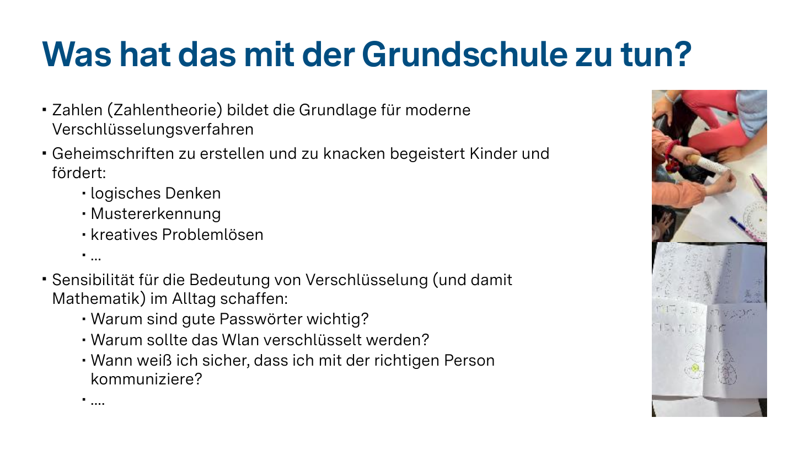

### Inhaltliche Anknüpfung

* **Zahlen und Zahlentheorie** (Primzahlen, Modulo-Rechnen) bilden die Grundlage moderner Verfahren.
* **Geheimschriften** faszinieren Kinder — eine niedrigschwellige Begegnung mit Mathematik.

### Prozessbezogene Kompetenzen

| Kompetenz | Wie wird sie gefördert? |
|---|---|
| **Logisches Denken** | Schlüssel finden, systematisch probieren |
| **Mustererkennung** | Häufigkeiten erkennen, Strukturen ausnutzen |
| **Kreatives Problemlösen** | Eigene Verschlüsselungen erfinden |
| **Argumentieren** | Begründen, warum ein Verfahren sicher / unsicher ist |
| **Kommunizieren** | Codes vereinbaren, Lösungswege beschreiben |

### Sensibilisierung für digitale Mündigkeit

Schon Grundschüler:innen können verstehen:

* Warum sind **gute Passwörter** wichtig?
* Warum sollte **WLAN verschlüsselt** sein?
* Wann weiß ich sicher, dass ich mit der **richtigen Person** kommuniziere?

## Konkrete Unterrichtsideen

1. **Caesar-Scheiben basteln** — Kinder fertigen aus zwei Pappkreisen drehbare Verschlüsselungsscheiben.
2. **Geheimschriften-Werkstatt** — Stationen mit verschiedenen Verfahren (Spiegelschrift, Skytale, Caesar, Symbolersetzung).
3. **Codeknacker-Detektive** — Klasse erhält verschlüsselte Schatzkarte und muss sie gemeinsam knacken.
4. **Eigene Geheimsprache** — Lerngruppen entwickeln ein Verfahren und tauschen Botschaften aus.
5. **Sicheres Passwort-Workshop** — was macht ein Passwort stark?

---

# 12. Quellen, Tools & weiterführende Materialien

## Interaktive Tools

* 🔗 [Caesar-Verschlüsselung](https://www.lernsoftware-mathematik.de/DiS/caesar.html)
* 🔗 [Caesar knacken (Häufigkeitsanalyse)](https://www.lernsoftware-mathematik.de/DiS/caesarknacken.html)
* 🔗 [Vigenère-Verfahren](https://www.lernsoftware-mathematik.de/DiS/vigenere.html)
* 🔗 [RSA-Verfahren](https://www.lernsoftware-mathematik.de/DiS/rsa.html)
* 🔗 [Vigenère knacken](https://oinf.ch/interactive/vigenere-verschluesselung-knacken/)


## Kontakt

**Prof. Dr. Christian Urff**
📧 christian.urff@ph-weingarten.de
🏛 Pädagogische Hochschule Weingarten
